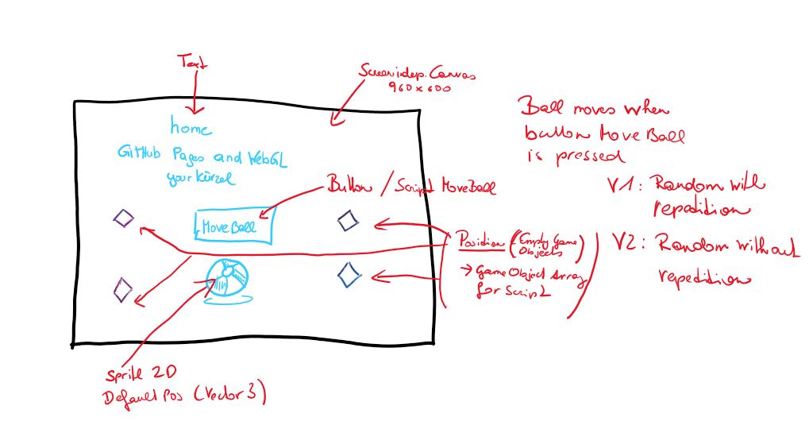

# home-WebGL-movingBall-aschnee

[Try the final build here](https://5ahmnm1920mtin-3h.github.io/home-WebGL-movingBall-lmartinusic/)

### Project description: 
This simple project consists of a screen-independent canvas (960x600), a button (Move Ball), a text (title with developer name), a script (moving the ball with the button), and a GameObjects ball (sprite2d imported)

When pressing the button "Move Ball" the ball moves randomly to a new position. 4 Positions are available (4 empty GameObjects: PosBottomLeft, PosBottomRight, PosTopLeft, PosTopRight). There are 2 different variations for moving the ball to the positions randomly.

Variation 1: direct repetition of the randomly chosen position is possible.
Variation 2: the randomly chosen position is forced to be different, i.e. new position != old position

### Development platform: 
* WIN: Windows 10
* Engine: Unity 2019.1.14f1
* IDE: Visual Studio Community 2019 Version 16.4.0
* Scripting Runtime Version: .NET 4.x Equivalent
* API Compatibility Level: .NET Standard 2.0

### Target platform: 
WebGL, reference resolution 960x600

### Visuals: 

© by [smeerws](https://github.com/smeerws/)

### Necessary setup/execution steps: 
* WebGL has to be installed

### Third party material: 
* None

### Project state: 
100% completed

### Limitations: 
* None

### Lessons Learned:
* Build for the WebGL platform
* Publish a WebGL project on GitHub Pages via folder docs
* Use exit-controlled do, while loop

copyrighted by Alina Schneeberger